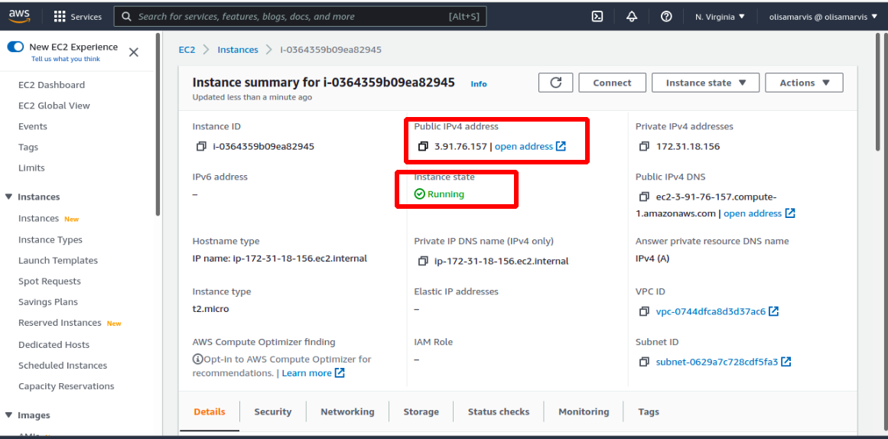

In this article, we’ll be implementing a web stack project using the LEMP stack in AWS. But before we dive in to the implementation, you’ll be wondering. What is a web stack or LEMP stack?
I’ll explain below.

# Web Stack
## What Does Web Stack Mean?

A web stack is a compilation of software applications, often needed for web development, especially for developing web applications and implementing websites. A web stack is a type of solution stack, which is a collection of software for performing specific tasks. Web stacks are critical components for web applications as well as websites.
 
A web stack is also known as a web application stack.
 
A web stack is usually comprised of: 
    • Operating system 
    • Database application 
    • Programming language 
    • Web server 
    
The operating system acts as the central interface between the hardware and software components. The web server helps in delivering the necessary documents to the clients who have requested them. Databases help in permanently storing volumes of data needed for the web project. The programming language or the script interpreter operates on the client side and helps realize dynamic web applications of websites. The collection of IT components in conjunction with proper server hardware helps in transferring essential information of the web projects to requesting clients.
 
Now that we have defined what a webstack is. Now let’s dive into the type of stack we’ll be using in this project(LAMP Stack).

LEMP is an open-source web application stack used to develop web applications.

### LEMP Stands For:
    • L- Linux Operating System
    • E- Nginx Server
    • M- MySQL Database
    • P- PHP
    
LEMP enjoys good community support and is used around the world in many highly scaled web applications. Nginx is the second most widely used web server in the world following Apache.

                                            Components of LEMP Stack
                                        
Every component of a stack communicates with each other. Let us discuss all the components in detail-

1. N stands for Nginx: It is a web server that follows an event-driven approach and handles multiple requests within one thread. Nginx supports all Unix-like OS and also supports windows partially.

When a web browser requests a web page that request is handled by the web server, here that web server is Nginx. Then the webserver passes that request to server-side technologies used in the LEMP stack for instance as a server-side scripting language like PHP to communicate with server and database.

2. P stands for PHP: It stands for Hypertext Preprocessor and is a scripting language that works on the server-side and communicates with the database MySQL and does all operations which user requests like fetching data, adding data, or manipulating data, or processing the data.

3. M stands for MySQL: It is an open-source SQL-based database that is used to store data and manipulate data while maintaining data consistency and integrity. It organizes data in tabular form in rows and columns. It is also ACID-compliant.

4. L stands for Linux: The web server runs on Linux operating system. It is free and open-source and well known to be highly secure and less vulnerable to malware and viruses even if compared to Windows or macOS.

## PRE-REQUISITES FOR THIS PROJECT

1. Create and register an AWS account following [this instruction](https://aws.amazon.com/premiumsupport/knowledge-center/create-and-activate-aws-account/)

As a new account, you qualify for the AWS free tier

`The AWS` free tier offers are only available to new AWS customers, and are available for 12 months following your AWS sign-up date. The AWS Free Tier provides customers the ability to explore and try out AWS services free of charge up to specified limits for each service.

2. Your Linux terminal. As all the commands that is required to implement the web stack will be done there.
Once this is done. You can log in to your AWS console and select the region closest to you.


Once this is done, you can type ‘EC2’ in the search bar and select it.


Then click on `launch new instance`


Now we are going to configure our EC2 instance! Select the `Ubuntu Server 20.04 LTS (HVM)` as the Amazon Machine Image (AMI).

The next step is to configure our EC2 Instance. We achieve this by selecting the Ubuntu Server LTS (HVM) as the Machine Image (AMI). Then choosing `t2 micro` as the instance type.


At this point, there’s nothing much to configure. So we click Review and launch.

The next step is to download our key pair and save it to a secure location. It’s important to note this part as we’ll need the key pair when we want to access our EC2 from the terminal.


After downloading the key pair, we click on launch and voila! Our Ec2 instance is ready. The next is to go to the instance and refresh the page till it changes from pending to running indicating that the instance is fully deployed. Then we copy the public IP address and save it on our notepad as we’ll need it later.




##  DEPLOYING OUR LEMP WEB SERVER: STAGE 1

**Connecting to our EC2 instance**

**IMPORTANT**- Anywhere you see these anchor tags < > , going forward, it means you will need to replace the content in there with values specific to your situation. For example, if you see `<private-key-name>.pem`. This will change to `private-key.pem` where `private-key` is the name of your own private key.

Now we move to the terminal in your linux OS.

- The terminal is already installed by default. You just need to open it up.
- We need the .pem key file which we saved from our EC2 downloaded from AWS.
- Change directory into the loacation where your PEM file is. Most likely will be in the Downloads folder

```
cd ~/Downloads
```
If you are having difficulty locating this place you can run the `ls` command in the terminal to list all the files and folders in your current directory. Then repeat the instructions above to locate the file.

Once you have located the key pair, use the command below to activate the key pair file (.pem). This command will also change permissions (otherwise you may get the error “Bad Permissions”):

```
$ sudo chmod 0400 <private-key-name>.pem
```

When prompted, type the password for your local PC and press Enter on your keyboard.
Remember the EC2 public IP address we copied earlier and saved on our notepad? The time to use it has come. So, copy the IP address and run the following command on your terminal.
```
ssh -i <Your-private-key.pem> ubuntu@<EC2-Public-IP-address>
```

You will be asked if you want to continue connecting. Type `Yes` and press Enter on your keyboard.


You should see your IP address at the top of your terminal interface if this is successful. Once this is done, we can move to the next stage.

## STAGE TWO: INSTALLING NGINX WEB SERVER

In order to display web pages to our site visitors, we are going to employ Nginx, a high-performance web server. We’ll use the <span style="color:blue">apt</span> package manager to install this package.

Since this is our first time using <span style="color:blue">apt</span> for this session, start off by updating your server’s package index. Following that, you can use <span style="color:blue">apt install</span> to get Nginx installed:

```
$ sudo apt update
$ sudo apt install nginx
```


When prompted, enter <span style="color:blue">Y</span>  to confirm that you want to install Nginx. Once the installation is finished, the Nginx web server will be active and running on your Ubuntu 20.04 server.

To verify that nginx was successfully installed and is running as a service in Ubuntu, run:
```
$ sudo systemctl status nginx
```
If it is green and running like in the picture below, then you did everything correctly - you have just launched your first Web Server in the Clouds!


### Configuring the firewall to allow HTTP Traffic

In order to receive traffic to our Web Server, it is imperative to open TCP port 80. This is the default port that web browsers utilize in order to access web pages on the Internet.

When we created the EC2 instance on the AWS console,the TCP port 22 was opened by default. This allowed us to access the EC2 via SSH in Terminal. However, we must add a rule to the security groups of our EC2 configuration, in order to allow inbound connections through port 80.

Begin by navigating to your EC2 instance on the AWS Console. Click on the security group tab and edit the inbound rules of the running EC2 instance.


Then click on `edit inbound rules as shown below`.


Then click on `Add rule` and configure the inbound rules using `HTTP` as the protocol and `0.0.0.0/0` as the source, so that traffic from any IP address can enter as shown below.


Our server is running and we can access it locally and from the Internet (Source 0.0.0.0/0 means ‘from any IP address’).

First, let us try to check how we can access it locally in our Ubuntu shell, On the Terminal, use the following command to send a request our Nginx on port 80.
```
$ curl http://localhost:80
or
$ curl http://127.0.0.1:80
```
You will see something like picture below in your terminal


These 2 commands above actually do pretty much the same - they use *‘curl’* command to request our Nginx on port 80 (actually you can even try to not specify any port - it will work anyway). The difference is that: in the first case we try to access our server via DNS name and in the second one - by IP address (in this case IP address 127.0.0.1 corresponds to [DNS name](https://en.wikipedia.org/wiki/Domain_Name_System) ‘localhost’ and the process of converting a DNS name to IP address is called “resolution”). We will touch DNS in further lectures and projects.

Next, we verify that we can access web server through the web browser using the public IP address of the EC2 instance. So, open a web browser of your choice and then enter the following url (remember to replace contents within the Anchor Tabs `< >` as was instructed in the beginning.

```
http://<Public-IP-Address>:80
```
The URL in browser shall also work if you do not specify port number since all web browsers use port 80 by default.

If you see following page, then your web server is now correctly installed and accessible through your firewall.


In fact, it is the same content that you previously got by ‘curl’ command, but represented in nice [HTML](https://en.wikipedia.org/wiki/HTML) format by your web browser. This is the default NGINX page.

## STAGE THREE: INSTALLING MYSQL

Now that we have installed and setup our Nginx web server. Next, we will install MySQL, which is an open-source relational database management system. This will allow us to store and manage data for the website. [MySQL](https://www.mysql.com/) is a popular relational database management system used within PHP environments, so we will use it in our project.

Begin by using the following command to install MySQL:

```
$ sudo apt install mysql-server
```
When prompted, confirm that you want to proceed with the installation by typing `Y` for "Yes", and then press the `enter` button on your keyboard.


When the installation is finished, it’s recommended that you run a security script that comes pre-installed with MySQL. This script will remove some insecure default settings and lock down access to your database system. Start the interactive script by running:

```
$ sudo mysql_secure_installation
```

This will ask if you want to configure the <span style="color:red">VALIDATE PASSWORD PLUGIN</span>.

```
**Note:** Enabling this feature is something of a judgment call. If enabled, passwords which don’t match the specified criteria will be rejected by MySQL with an error. It is safe to leave validation disabled, but you should always use strong, unique passwords for database credentials.
```

Answer <span style="color:red">Y</span> for yes, or anything else to continue without enabling.
Answer <span style="color:red">Y</span> for yes, or anything else to continue without enabling.

```
VALIDATE PASSWORD PLUGIN can be used to test passwords
and improve security. It checks the strength of password
and allows the users to set only those passwords which are
secure enough. Would you like to setup VALIDATE PASSWORD plugin?

Press y|Y for Yes, any other key for No:
```

If you answer “yes”, you’ll be asked to select a level of password validation. Keep in mind that if you enter <span style="color:red">2</span> for the strongest level, you will receive errors when attempting to set any password which does not contain numbers, upper and lowercase letters, and special characters, or which is based on common dictionary words.

```
There are three levels of password validation policy:

LOW    Length >= 8
MEDIUM Length >= 8, numeric, mixed case, and special characters
STRONG Length >= 8, numeric, mixed case, special characters and dictionary

Please enter 0 = LOW, 1 = MEDIUM and 2 = STRONG: 1
```

Regardless of whether you chose to set up the <span style="color:red">VALIDATE PASSWORD PLUGIN</span>, your server will next ask you to select and confirm a password for the MySQL **root** user. This is not to be confused with the **system root**. The **database root** user is an administrative user with full privileges over the database system. Even though the default authentication method for the MySQL root user dispenses the use of a password, **even when one is set**, you should define a strong password here as an additional safety measure. We’ll talk about this in a moment.

If you enabled password validation, you’ll be shown the password strength for the root password you just entered and your server will ask if you want to continue with that password. If you are happy with your current password, enter **Y** for **“yes”** at the prompt:

```
Estimated strength of the password: 100 
Do you wish to continue with the password provided?(Press y|Y for Yes, any other key for No) : y
```

For the rest of the questions, press <span style="color:red">Y</span> and hit the <span style="color:red">ENTER</span> key at each prompt. This will remove some anonymous users and the test database, disable remote root logins, and load these new rules so that MySQL immediately respects the changes you have made.


Next, you can check whether you can log in to the MySQL console by typing the following command. 

```
$ sudo mysql
```
This command allows you to connect to the MySQL server as the administrative user (root user), which is implied by the use of 'sudo' part of the command. This will connect to the MySQL server as the administrative database user **root**, which is inferred by the use of sudo when running this command. 
To exit the MySQL console, type:

```
mysql> exit
```
You should see the following output:


## STAGE FOUR: INSTALLING PHP

You have Nginx installed to serve your content and MySQL installed to store and manage your data. Now you can install [PHP](https://www.php.net/) to process code and generate dynamic content for the web server.

Nginx requires an external program to handle PHP processing and act as a bridge between the PHP interpreter itself and the web server. This allows for a better overall performance in most PHP-based websites, but it requires additional configuration. You’ll need to install <span style="color:red">php-fpm</span>, which stands for `PHP fastCGI process manager`, and tell Nginx to pass PHP requests to this software for processing. Additionally, you’ll need <span style="color:red">php-mysql</span>, a PHP module that allows PHP to communicate with MySQL-based databases. Core PHP packages will automatically be installed as dependencies.

To install these 2 packages at once, run:
```
$ sudo apt install php-fpm php-mysql
```


When prompted, type <span style="color:red">Y</span> and press <span style="color:red">ENTER</span> to confirm installation.

### Configuring Nginx to Use PHP Processor

When using the Nginx web server, we can create server blocks (similar to virtual hosts in Apache) to encapsulate configuration details and host more than one domain on a single server. In this guide, we will use **projectLEMP** as an example domain name.

On Ubuntu 20.04, Nginx has one server block enabled by default and is configured to serve documents out of a directory at <span style="color:red">/var/www/html</span>. While this works well for a single site, it can become difficult to manage if you are hosting multiple sites. Instead of modifying <span style="color:red">/var/www/html</span>, we’ll create a directory structure within <span style="color:red">/var/www</span> for the your_domain website, leaving <span style="color:red">/var/www/html</span> in place as the default directory to be served if a client request does not match any other sites.

Create the root web directory for **your_domain** as follows:
```
$ sudo mkdir /var/www/projectLEMP
```

Next, assign ownership of the directory with the $USER environment variable, which will reference your current system user:
```
$ sudo chown -R $USER:$USER /var/www/projectLEMP
```
You now have your PHP components installed. Next, you will configure Nginx to use them.

###  Configuring Nginx to Use PHP Processor

When using the Nginx web server, we can create server blocks (similar to virtual hosts in Apache) to encapsulate configuration details and host more than one domain on a single server. In this guide, we will use **projectLEMP** as an example domain name.

On Ubuntu 20.04, Nginx has one server block enabled by default and is configured to serve documents out of a directory at <span style="color:red">/var/www/html</span>. While this works well for a single site, it can become difficult to manage if you are hosting multiple sites. Instead of modifying <span style="color:red">/var/www/html</span>, we’ll create a directory structure within <span style="color:red">/var/www</span> for the your_domain website, leaving <span style="color:red">/var/www/html</span> in place as the default directory to be served if a client request does not match any other sites.

Create the root web directory for **your_domain** as follows:

```
$ sudo mkdir /var/www/projectLEMP
```

Next, assign ownership of the directory with the $USER environment variable, which will reference your current system user:

```
$ sudo chown -R $USER:$USER /var/www/projectLEMP
```
Then, open a new configuration file in Nginx’s <span style="color:red">sites-available</span> directory using your preferred command-line editor. Here, we’ll use <span style="color:red">nano</span>:

```
$ sudo nano /etc/nginx/sites-available/projectLEMP
```
This will create a new blank file. Paste in the following bare-bones configuration:
```
#/etc/nginx/sites-available/projectLEMP

server {
    listen 80;
    server_name projectLEMP www.projectLEMP;
    root /var/www/projectLEMP;

    index index.html index.htm index.php;

    location / {
        try_files $uri $uri/ =404;
    }

    location ~ \.php$ {
        include snippets/fastcgi-php.conf;
        fastcgi_pass unix:/var/run/php/php7.4-fpm.sock;
     }

    location ~ /\.ht {
        deny all;
    }

}
```


Here’s what each of these directives and location blocks do:
- <span style="color:red">listen</span> — Defines what port Nginx will listen on. In this case, it will listen on port `80`, the default port for HTTP.

- <span style="color:red">root</span> — Defines the document root where the files served by this website are stored.

- <span style="color:red">index</span>— Defines in which order Nginx will prioritize index files for this website. It is a common practice to list `index.html` files with a higher precedence than `index.php` files to allow for quickly setting up a maintenance landing page in PHP applications. You can adjust these settings.

- <span style="color:red">server_name</span> — Defines which domain names and/or IP addresses this server block should respond for. **Point this directive to your server’s domain name or public IP address**.

- <span style="color:red">location /</span> — The first location block includes a `try_files` directive, which checks for the existence of files or directories matching a URI request. If Nginx cannot find the appropriate resource, it will return a 404 error.

- <span style="color:red">location ~ \.php$</span> — This location block handles the actual PHP processing by pointing Nginx to the fastcgi-php.conf configuration file and the `php7.4-fpm.sock file`, which declares what socket is associated with `php-fpm`.

- <span style="color:red">location ~ /\.ht</span> — The last location block deals with <span style="color:red">.htaccess</span> files, which Nginx does not process. By adding the deny all directive, if any `.htaccess` files happen to find their way into the document root ,they will not be served to visitors.


When you’re done editing, save and close the file. If you’re using `nano`, you can do so by typing  `CTRL+S` to save, then `CTRL+X` and then `ENTER` to confirm.

Activate your configuration by linking to the config file from Nginx’s <span style="color:blue">sites-enabled</span> directory:

```
$ sudo ln -s /etc/nginx/sites-available/projectLEMP /etc/nginx/sites-enabled/
```

This will tell Nginx to use the configuration next time it is reloaded. You can test your configuration for syntax errors by typing:

```
$ sudo nginx -t
```
You should see the following messages on the terminal.


If any errors are reported, go back to your configuration file to review its contents before continuing.

We also need to disable default Nginx host that is currently configured to listen on port 80, for this run:

```
sudo unlink /etc/nginx/sites-enabled/default
```

When you are ready, reload Nginx to apply the changes:

```
$ sudo systemctl reload nginx
```

Well done! Your new website is now active, but the web root /var/www/projectLEMP is still empty. Create an index.html file in that location so that we can test that your new server block works as expected:

```
sudo echo 'Hello LEMP from hostname' $(curl -s http://169.254.169.254/latest/meta-data/public-hostname) 'with public IP' $(curl -s http://169.254.169.254/latest/meta-data/public-ipv4) > /var/www/projectLEMP/index.html
```

Now that we have added the index.html file. Go to your browser and try to open your website URL using IP address:

```
http://<Public-IP-Address>:80
```

You should see something like the image below.


If you get this output then congrats! Your LEMP stack is now fully configured.

### Testing PHP with Nginx

Here we’ll create a PHP script to test that Nginx is in fact able to handle `.php` files within your newly configured website.
You can do this by creating a test PHP file in your document root. 
So, open a new file called `info.php` within your document root in your text editor:

```
$ nano /var/www/projectLEMP/info.php
```

Type or paste the following lines into the new file. This is valid PHP code that will return information about your server:
```
<?php
phpinfo();
```


You can now access this page in your web browser by visiting the domain name or public IP address you’ve set up in your Nginx configuration file, followed by `/info.php`.

```
http://`server_domain_or_IP`/info.php
```

You will see a web page containing detailed information about your server:


After checking the relevant information about your PHP server through that page, it’s best to remove the file you created as it contains sensitive information about your PHP environment and your Ubuntu server. You can use <span style="color:red">rm</span> to remove that file:

```
$ sudo rm /var/www/your_domain/info.php
```

You can always regenerate this file if you need it later.

### Retrieving data from MySQL database with PHP

Phew, we are almost done!); . I must commend your patience, but we still have some work to do before we wrap it up.

In this step you will create a test database (DB) with simple “To do list” and configure access to it, so the Nginx website would be able to query data from the DB and display it. To achieve this we will create a database named **example_database** and a user named **example_user**, but you can replace these names with different values if you wish. Just make sure you stick to whatever name you choose to avoid any mixup.

First, connect to the MySQL console using the **root** account:

```
$ sudo mysql
```


To create a new database, run the following command from your MySQL console:

```
mysql> CREATE DATABASE `example_database`;
```
Next, let's create an example_user that has full privileges on the database. The default authentication method will be `mysql_native_password`. **Please note:** for this example, the password will be **password**, however please replace the password field with a more secure password of your own choice.


```
mysql>  CREATE USER 'example_user'@'%' IDENTIFIED WITH mysql_native_password BY 'password';
```

Now we need to give this user permission over the <span style="color:red">example_database</span> database:

```
mysql> GRANT ALL ON example_database.* TO 'example_user'@'%';
```

This will give the **example_user** user full privileges over the **example_database** database, while preventing this user from creating or modifying other databases on your server.

Now exit the MySQL shell with:

```
mysql> exit
```

You can test if the new user has the proper permissions by logging in to the MySQL console again, this time using the custom user credentials:
```
$ mysql -u example_user -p
```


Notice the <span style="color:red">-p</span> flag in this command, which will prompt you for the password used when creating the <span style="color:red">example_user</span> user. After logging in to the MySQL console, confirm that you have access to the `example_database` database:
```
mysql> SHOW DATABASES;
```

This will give you the following output:


Next, we’ll create a test table named **todo_list**. From the MySQL console, run the following statement:

```
CREATE TABLE example_database.todo_list (
mysql>     item_id INT AUTO_INCREMENT,
mysql>     content VARCHAR(255),
mysql>     PRIMARY KEY(item_id)
mysql> );
```
**Please Note:*** Don’t just copy and paste the above whole command into the terminal. Copy and paste them row after row. Otherwise it’ll give you a syntax error. For eg copy `example_database.todo_list (` and press `enter`.
Then do the same for the rest of the commands till you get to the last row, which is `);`

Next we insert a few rows of content in the test table. You might want to repeat the next command a few times, using different VALUES:

```
mysql> INSERT INTO example_database.todo_list (content) VALUES ("My first important item");
```
For example, after running the above command. Also type or post the below command into the terminal

```
mysql> INSERT INTO example_database.todo_list (content) VALUES ("My second important item");
```
Notice I changed the `VALUES` to `“My second important item"`. You can add yours.

To confirm that the data was successfully saved to your table, run:

```
mysql>  SELECT * FROM example_database.todo_list;
```
After confirming that you have valid data in your test table, you can exit the MySQL console:

```
mysql> exit
```

You’ll see the following output:


Now you can create a PHP script that will connect to MySQL and query for your content. Create a new PHP file in your custom web root directory using your preferred editor.
```
$ nano /var/www/projectLEMP/todo_list.php
```

The following PHP script connects to the MySQL database and queries for the content of the **todo_list** table, displays the results in a list. If there is a problem with the database connection, it will throw an exception.

The following PHP script connects to the MySQL database and queries for the content of the **todo_list** table, displays the results in a list. If there is a problem with the database connection, it will throw an exception.

Copy this content into your <span style="color:red">todo_list.php</span> script:

```
<?php
$user = "example_user";
$password = "password";
$database = "example_database";
$table = "todo_list";

try {
  $db = new PDO("mysql:host=localhost;dbname=$database", $user, $password);
  echo "<h2>TODO</h2><ol>";
  foreach($db->query("SELECT content FROM $table") as $row) {
    echo "<li>" . $row['content'] . "</li>";
  }
  echo "</ol>";
} catch (PDOException $e) {
    print "Error!: " . $e->getMessage() . "<br/>";
    die();
}
```


Save and close the file when you are done editing.

You can now access this page in your web browser by visiting the domain name or public IP address configured for your website, followed by <span style="color:red">/todo_list.php</span>:

```
http://<Public_domain_or_IP>/todo_list.php
```

You should see a page like this, showing the content you’ve inserted in your test table:


I will like to congratulate you. For you have completed the web stack implementation project using `LEMP stack in AWS!`. Well done! :grin:.
